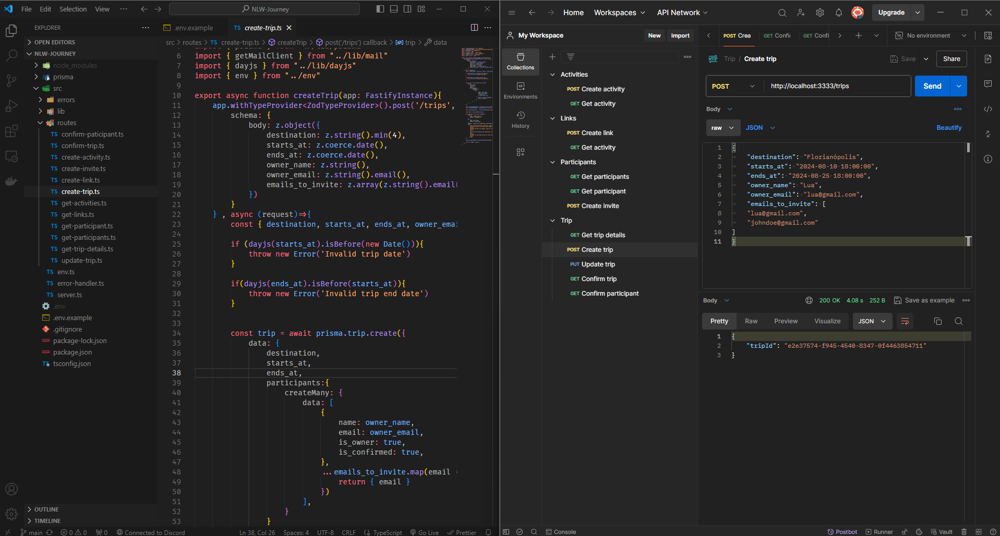

# Planner App API

Backend do Planner, uma aplicação de gerenciamento de viagens.

## ✨ Tecnologias

Esse projeto foi desenvolvido com as seguintes tecnologias:

- [Node.js](https://nodejs.org/en/)
- [Typescript](https://www.typescriptlang.org/)
- [Fastify](https://fastify.dev/)
- [Prisma](https://www.prisma.io/)
- [Nodemailer](https://nodemailer.com/)
- [Dayjs](https://day.js.org)

## 📷 Preview

